# ADMINISTRATION IT - Lab 04 - Docker  

> Auteurs : Muaremi Dejvid - Silvestri Romain  
> Enseignant : Graf Marcel   
> Assistants : Gardel Bastian   
> Date : 29.12.2018  
---  

## Table of content
1. [Introduction](#intro)
2. [Identify issues and install the tools](#task-0)
3. [Add a process supervisor to run several processes](#task-1)
4. [Add a tool to manage membership in the web server cluster](#task-2)
5. [React to membership changes](#task-3)
6. [Use a template engine to easily generate configuration files](#task-4)
7. [Generate a new load balancer configuration when membership changes](#task-5)
8. [Make the load balancer automatically reload the new configuration](#task-6)
9. [Difficulties](#difficulties)
9. [Conclusion](#conclusion)


## <a name="intro"></a>Introduction
blablabla

**Remarks**
The version of HAProxy used in this lab is `1.5`. When reading the documentation, make sure you are looking at this version. Here is the link: <http://cbonte.github.io/haproxy-dconv/configuration-1.5.html>

There is an exception for that later in the lab. The documentation for a part of HAProxy (the command line help) is not available in 1.5. Therefore, we use the doc for 1.6 which is not different for our usage.

We forked the lab from the original [project](https://github.com/SoftEng-HEIGVD/Teaching-HEIGVD-AIT-2016-Labo-Docker "SoftEng's repository")

**Disclaimer**
In this lab, we will go through one possible approach to manage a scalable infrastructure where we can add and remove nodes without having to rebuild the HAProxy image. This is not the only way to achieve this goal. If you do some research you will find a lot of tools and services to achieve the same kind of behavior.


## <a name="task-0"></a>Task 0: Identify issues and install the tools

1. <a name="M1"></a>**[M1] Do you think we can use the current solution for a production environment? What are the main problems when deploying it in a production environment?**  

    No. The problem is that you have to declare all the servers manually in the config files. Everytime a server is added or removed, the files must be manually edited wich take time and work. Furthermore, since the config files are edited, for the changes to take effect, the images must be rebuild after the modifications.

2. <a name="M2"></a>**[M2] Describe what you need to do to add new `webapp` container to the infrastructure. Give the exact steps of what you have to do without modifiying the way the things are done. Hint: You probably have to modify some configuration and script files in a Docker image.**  

    The following lines must be added in the correct files:  
    In the ``hapoxy.cfg`` file:
    ```
    server s3 <s3>:3000 check
    ```
    This line add a new node to the balancing mechanism list.  
    In the ``run.sh `` file:
    ```
    sed -i 's/<s3>/$S3_PORT_3000_TCP_ADDR/g' /usr/local/etc/haproxy/haproxy.cfg
    ```
    In the ``provision.sh`` file, the following line :   
    ```
    docker run -d -p 80:80 -p 1936:1936 -p 9999:9999 --link s1 --link s2
    --name ha softengheigvd/ha
    ```
    must be changed so that the ports of the new node are also linked. So the line become:
    ```
    docker run -d -p 80:80 -p 1936:1936 -p 9999:9999 --link s1 --link s2 --link s3
    --name ha softengheigvd/ha
    ```  
    Always in the same file:  
    ```
    docker rm -f s3 2>/dev/null || true
    docker run -d --name s3 softengheigvd/webapp
    ```
    This line run the new webapp.  
    After all the changes are done, the images must be rebuild so the changes are effectives.

3. <a name="M3"></a>**[M3] Based on your previous answers, you have detected some issues in the current solution. Now propose a better approach at a high level.**  

    The ideal solution would be to have a programm that is always running and that, everytime a node is added or removed, edit the files above by adding or removing the lines mentionned in M2.
4. <a name="M4"></a>**[M4] You probably noticed that the list of web application nodes is hardcoded in the load balancer configuration. How can we manage the web app nodes in a more dynamic fashion?**  

    Using the above proposition which is: having a programm monitoring the nodes and changing the files when a change occures. In this lab, we will be using is ``Serf`` which is a cluster management tool. Each container have a ``Serf`` agent running and are communicating with each others, sending informations about the nodes and their ip addresses. This allow the load balancer to know when a change happens (a node appearing or disappearing for example) and thus, modify the files accordingly.  

5. <a name="M5"></a>**[M5] In the physical or virtual machines of a typical infrastructure we tend to have not only one main process (like the web server or the load balancer) running, but a few additional processes on the side to perform management tasks.**
**For example to monitor the distributed system as a whole it is common to collect in one centralized place all the logs produced by the different machines. Therefore we need a process running on each machine that will forward the logs to the central place. (We could also imagine a central tool that reaches out to each machine to gather the logs. That's a push vs. pull problem.) It is quite common to see a push mechanism used for this kind of task.**
**Do you think our current solution is able to run additional management processes beside the main web server / load balancer process in a container? If no, what is missing / required to reach the goal? If yes, how to proceed to run for example a log forwarding process?**  

    No. Currently, only one process is runned in each container. When this process is finished, the container dies. We need to have multiple processes running in the same container. To do this, we will need to add a process supervisor to each container. In this lab, we will use ``S6`` which will give us the possibility to run one or more processes at a time in a Docker container.  

6. <a name="M6"></a>**[M6] In our current solution, although the load balancer configuration is changing dynamically, it doesn't follow dynamically the configuration of our distributed system when web servers are added or removed. If we take a closer look at the `run.sh` script, we see two calls to `sed` which will replace two lines in the `haproxy.cfg` configuration file just before we start `haproxy`. You clearly see that the configuration file has two lines and the script will replace these two lines.**
**What happens if we add more web server nodes?**
**Do you think it is really dynamic?**
**It's far away from being a dynamic configuration. Can you propose a solution to solve this?**  

    When a new nodes is added, we need to generate a new conf file for the node balancer. In the current solution, this has to be done manually so it is not dynamic at all. The solution that will be used in this lab is to use templates. To generate the config files, the templates use the datas provided by the ``Serf`` agents.

**Deliverables**:
1. **Take a screenshot of the stats page of HAProxy at <http://192.168.42.42:1936>. You should see your backend nodes.**
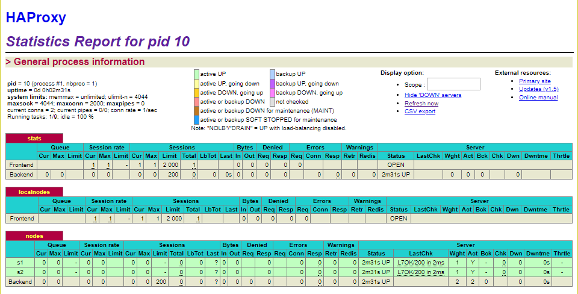
2. **Give the URL of your repository URL in the lab report.**
The [URL](https://github.com/DDejviDD/Teaching-HEIGVD-AIT-2016-Labo-Docker "https://github.com/DDejviDD/Teaching-HEIGVD-AIT-2016-Labo-Docker") of our repository.


## <a name="task-1"></a>Task 1: Add a process supervisor to run several processes

**Deliverables**:
1. **Take a screenshot of the stats page of HAProxy at <http://192.168.42.42:1936>. You should see your backend nodes. It should be really similar to the screenshot of the previous task.**
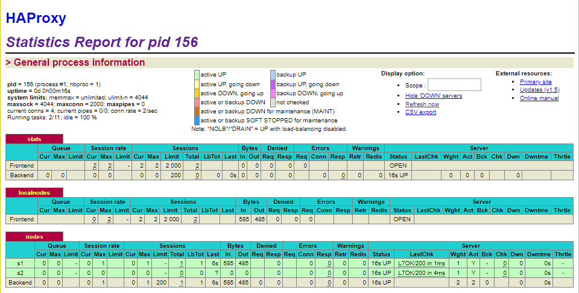

2. **Describe your difficulties for this task and your understanding of what is happening during this task. Explain in your own words why are we installing a process supervisor. Do not hesitate to do more research and to find more articles on that topic to illustrate the problem.**  

    We had no particular difficulties in this task.  
    The goal this task is to allow our container to run more than one process by adding a process supervisor to the images. This supervisor allow a container to run multiple processes and prevent the death of the container upon process' completion (which is the base behavoior of containers and the philosophy of Docker). The process supervisor that we use in this lab is ``S6-overlay``.


## <a name="task-2"></a>Task 2: Add a tool to manage membership in the web server cluster

**Deliverables**:
1. **Provide the docker log output for each of the containers: `ha`, `s1` and `s2`. You need to create a folder `logs` in your repository to store the files separately from the lab report. For each lab task create a folder and name it using the task number. No need to create a folder when there are no logs.**   
    The folder for the logs for every is in `/logs/` there's a folder for every task and every container in it, just like this :
    ```
   |-- root folder
     |-- logs
       |-- task 2
          |-- ha
          |-- s1
          |-- s2
       |-- task 3
          |-- ha
          |-- s1
          |-- s2
       |-- ...
   ```

2. **Give the answer to the question about the existing problem with the current solution.**
    The main problem of this solution is that we must create a link between haproxy and the backend nodes, like in the following script:
    ```bash
    docker run -d -p 80:80 -p 1936:1936 -p 9999:9999 --network heig --link s1 --link s2 --name ha softengheigvd/ha
    docker run -d --network heig --name s1 softengheigvd/webapp
    ```
    This means that we have to restart all our nodes and the proxy everytime we want to add a new one. Also, the --link flag is now a legacy feature and should not be used. There's more details about it in the [official documentation of docker about the --link flag](https://docs.docker.com/network/links/).

3. **Give an explanation on how `Serf` is working. Read the official website to get more details about the `GOSSIP` protocol used in `Serf`. Try to find other solutions that can be used to solve similar situations where we need some auto-discovery mechanism.**  

  ``Serf`` is a tool for cluster management. It create a cluster with every nodes and allow them to speak with each others. To do so, every node has a ``Serf agent`` that communicate with the others, informing them of it's status. This allows all the nodes to be notified when a new node arrives or one of the existing one is leaving the cluser.  
  ``Serf`` can automatically detect failed nodes within seconds, notify the rest of the cluster and execute custom handler scripts allowing to handle those events (failed nodes or membership changes). The tool is also able to broadcast custom events and queries for the cluster (can be used to trigger deploy, propagate configuration, ...).  
  ``GOSSIP`` is the communication protocol used by ``Serf``. It use the UDP protocol to broadcast messages in the cluster. This protocol solve the three major problems that ``Serf`` encounter which are: Membership, Failure detection and recovery and Custom event propagation.  

  Other solutions:
  - Apache ZooKeeper
  - Consul

  Source: https://www.serf.io/intro/index.html


## <a name="task-3"></a>Task 3: React to membership changes

**Deliverables**:

1. **Provide the docker log output for each of the containers:  `ha`, `s1` and `s2`. Put your logs in the `logs` directory you created in the previous task.**
    All the logs are under the log directory for this task `/logs/task3/<container name>`.
3. **Provide the logs from the `ha` container gathered directly from the `/var/log/serf.log` file present in the container. Put the logs in the `logs` directory in your repo.**
    The log is under the log directory for this task `/logs/task3/ha/2-serf`.


## <a name="task-4"></a>Task 4: Use a template engine to easily generate configuration files

**Deliverables**:

1. **You probably noticed when we added `xz-utils`, we have to rebuild the whole image which took some time. What can we do to mitigate that? Take a look at the Docker documentation on[image layers](https://docs.docker.com/engine/userguide/storagedriver/imagesandcontainers/#images-and-layers). Tell us about the pros and cons to merge as much as possible of the command. In other words, compare:**  
    ```
    RUN command 1
    RUN command 2
    RUN command 3
    ```

    vs.

    ```
    RUN command 1 && command 2 && command 3
    ```

    In the older version of Docker, each time you the ``RUN`` command is used, a layer is created. It is preferable to have a minimal number of layer in an image to reduce it size. By chaining the commands, the number of layers is greatly reduce which improve the image building speed.  
    On the other hand, chaining commands make the Dockerfile very hard to read and, because of this, hard to reused in the future.  
    The advantage of multiple ``RUN`` is that, if your layers will be used in other images, the caching mechanism can be used.  
    Since the version 17.05 of Docker, the best practice is to keep the dockerfile readable and use multistage builds to keep the number of layers as low as possible.  
    Source: https://stackoverflow.com/questions/39223249/multiple-run-vs-single-chained-run-in-dockerfile-what-is-better

    **There are also some articles about techniques to reduce the image size. Try to find them. They are talking about `squashing` or `flattening` images.**  
    - http://jasonwilder.com/blog/2014/08/19/squashing-docker-images/
    - https://tuhrig.de/flatten-a-docker-container-or-image/


2. **Propose a different approach to architecture our images to be able to reuse as much as possible what we have done. Your proposition should also try to avoid as much as possible repetitions between your images.**  

   To reuse the layers as much as possible, the caching mechanism must be used. To do so, the parts that are used in multiple images must have their separate ``RUN`` command so that Docker can cache and re-use them.  
   The other commands should be chained so that the number of layers is minimal which reduce the size of the images and reduce their build spe

3. **Provide the `/tmp/haproxy.cfg` file generated in the `ha` container after each step.  Place the output into the `logs` folder like you already did for the Docker logs in the previous tasks. Three files are expected. In addition, provide a log file containing the output of the `docker ps` console and another file (per container) with `docker inspect <container>`. Four files are expected.**
    The `/tmp/haproxy.cfg` log generated in the `ha` container after each step are the following one :
    - `/logs/task4/ha/0-haproxy_cfg-ha`
    - `/logs/task4/ha/1-haproxy_cfg-s1`
    - `/logs/task4/ha/2-haproxy_cfg-s2`
    The output of the `docker ps` console is in :
    - `/logs/task4/3-docker_ps`
    The output of the `docker inspect <container>` console is in :
    - `/logs/task4/4-docker_inspect_ha`
    - `/logs/task4/5-docker_inspect_s1`
    - `/logs/task4/6-docker_inspect_s2`

4. **Based on the three output files you have collected, what can you say about the way we generate it? What is the problem if any?**

    Each time a node join the cluster, the content of this file is overwritten. The only information in it is the id and the ip of the last node added. The new data should be added at the end of the file instead of writing over existing data.


## <a name="task-5"></a>Task 5: Generate a new load balancer configuration when membership changes

**Deliverables**:

1. **Provide the file `/usr/local/etc/haproxy/haproxy.cfg` generated in the `ha` container after each step. Three files are expected. In addition, provide a log file containing the output of the `docker ps` console and another file (per container) with `docker inspect <container>`. Four files are expected.**
    The `/usr/local/etc/haproxy/haproxy.cfg` log generated in the `ha` container after each step are the following one :
    - `/logs/task5/ha/0-haproxy_cfg-ha`
    - `/logs/task5/ha/1-haproxy_cfg-s1`
    - `/logs/task5/ha/2-haproxy_cfg-s2`
    The output of the `docker ps` console is in :
    - `/logs/task5/3-docker_ps`
    The output of the `docker inspect <container>` console is in :
    - `/logs/task5/4-docker_inspect_ha`
    - `/logs/task5/5-docker_inspect_s1`
    - `/logs/task5/6-docker_inspect_s2`

2. **Provide the list of files from the `/nodes` folder inside the `ha` container. One file expected with the command output.**
    The output of the `ls -la` in the `/nodes` directory is in :
    - `/logs/task5/ha/7-nodes`

3. **Provide the configuration file after you stopped one container and the list of nodes present in the `/nodes` folder. One file expected with the command output. Two files are expected. In addition, provide a log file containing the output of the `docker ps` console. One file expected.**
    The `/usr/local/etc/haproxy/haproxy.cfg` log generated in the `ha` container once we stopped one container is in :
    - `/logs/task5/ha/8-haproxy_cfg-stop_s1`
    The output of the `ls -la` in the `/nodes` directory once we stopped one container is in :
    - `/logs/task5/ha/9-node-stop_s1`
    The output of the `docker ps` console once we stopped one container is in :
    - `/logs/task5/10-docker_ps-stop_s1`

      
4. **(Optional:) Propose a different approach to manage the list of backend nodes. You do not need to implement it. You can also propose your own tools or the ones you discovered online. In that case, do not forget to cite your references.**

## <a name="task-6"></a>Task 6: Make the load balancer automatically reload the new configuration


**Deliverables**:

1. **Take a screenshots of the HAProxy stat page showing more than 2 web applications running. Additional screenshots are welcome to see a sequence of experimentations like shutting down a node and starting more nodes.**
**Also provide the output of `docker ps` in a log file. At least one file is expected. You can provide one output per step of your experimentation according to your screenshots.**
    To test our solution we've been through the following scenario, once everything was set :
    0. We start the first node, `s1` and copy the output of the `docker ps` in `/logs/task6/0-docker_ps-start_s1` and the screenshot from both the webapp and the stat page.
    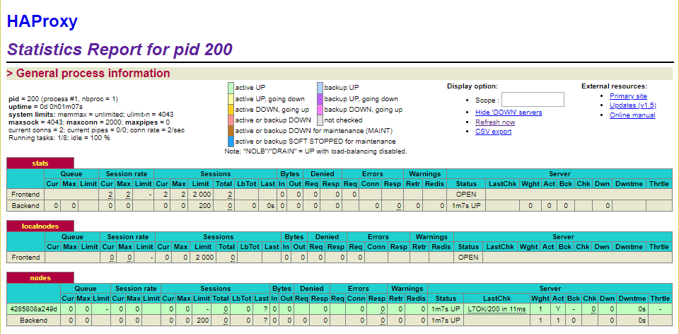
    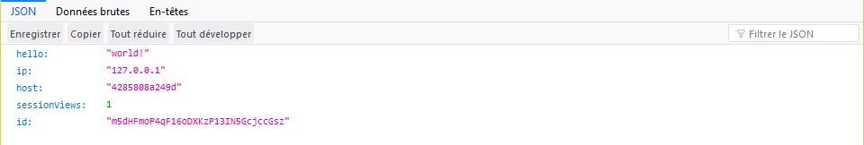
    1.We start the second node, `s2` and copy the output of the `docker ps` in `/logs/task6/1-docker_ps-start_s2` and the screenshot from both the webapp and the stat page.
    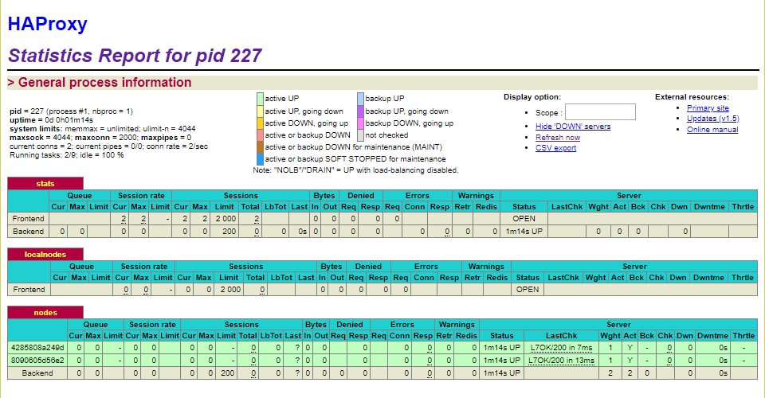
    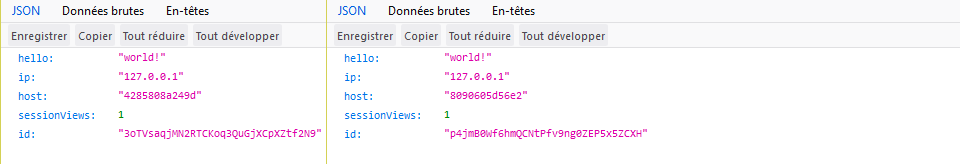
    2.We start the third node, `s3` and copy the output of the `docker ps` in `/logs/task6/2-docker_ps-start_s3` and the screenshot from both the webapp and the stat page.
    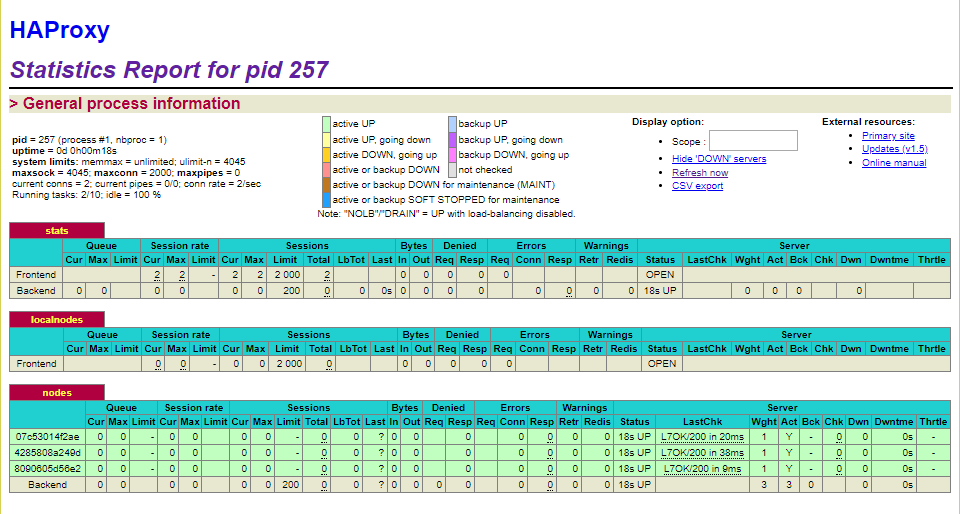
    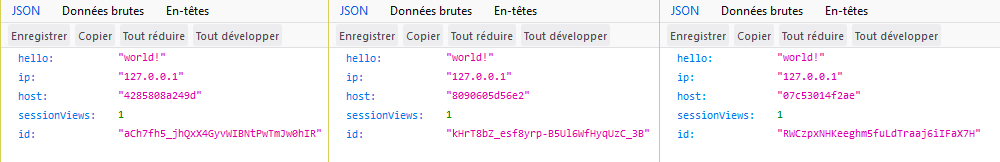
    3.We stop the second node, `s2` and copy the output of the `docker ps` in `/logs/task6/3-docker_ps-stop_s2` and the screenshot from both the webapp and the stat page.
    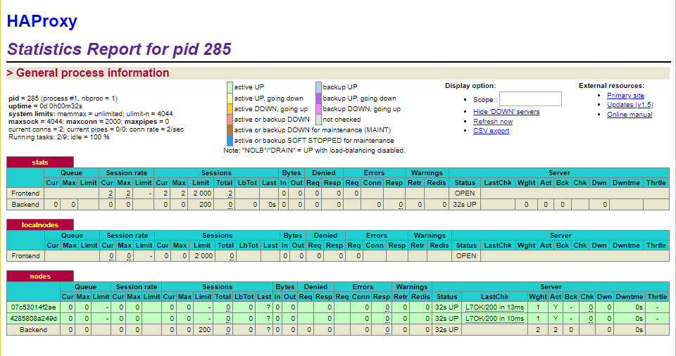
    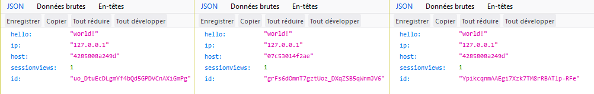
    4.We start another node, `s4` and copy the output of the `docker ps` in `/logs/task6/4-docker_ps-start_s4` and the screenshot from both the webapp and the stat page.
    
    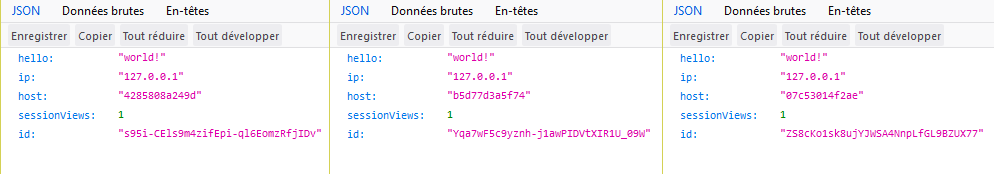

    During this process, we could see that the proxy was able to manage the nodes even if we start or stop some nodes, everything was automatic but it takes a small amount of time to do it, something like 1 or 2 seconds.
    
2. **Give your own feelings about the final solution. Propose improvements or ways to do the things differently. If any, provide references to your readings for the improvements.**

3. **(Optional:) Present a live demo where you add and remove a backend container.**
    During the live demo, we will execute the following script step by step to show how our solution works.

    ```bash
    # Start everything
    vagrant up
    vagrant ssh

    # Clean it
    docker stop $(docker ps -q)
    docker rm $(docker ps -aq)
    docker rmi softengheigvd/ha:latest softengheigvd/webapp:latest

    # Configure the subnet heig
    docker network create --driver bridge heig

    # Build the new images
    cd /vagrant/ha
    docker build -t softengheigvd/ha .
    cd /vagrant/webapp
    docker build -t softengheigvd/webapp .

    # To start the proxy
    docker run -d -p 80:80 -p 1936:1936 -p 9999:9999 --network heig --name ha softengheigvd/ha

    # To start the backend nodes
    docker run -d --network heig --name s1 softengheigvd/webapp
    docker run -d --network heig --name s2 softengheigvd/webapp
    docker run -d --network heig --name sx softengheigvd/webapp

    # To check...
    # the node list
    docker exec -ti ha /bin/bash
    ls -la /nodes
    # the ha config file
    docker exec -ti ha /bin/bash
    cat /usr/local/etc/haproxy/haproxy.cfg
    ```
    And we will show the changes in the [webapp](http://192.168.42.42) and the [stat page](http://192.168.42.42:1936).


## <a name="difficulties"></a>Difficulties

**Cleanup**: need to change the dockerfile to not copy the scripts

  - As we have changed the way we start our reverse proxy and web application, we can remove the original `run.sh` scripts. You can use the following commands to clean these two files (and folder in case of web application).   ```bash
  rm /vagrant/ha/scripts/run.sh
  rm -r /vagrant/webapp/scripts
  ```


## <a name="conclusion"></a>Conclusion
